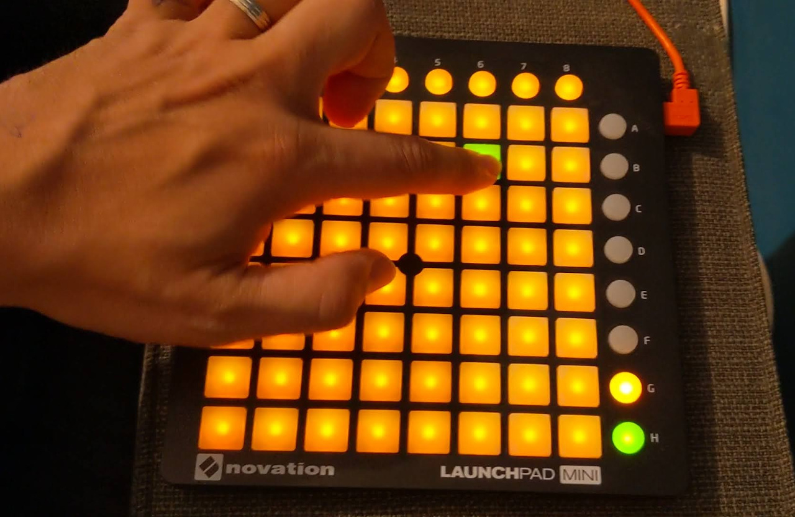

# Whack-a-Launchpad

Whack-a-mole inspired game using Novation Launchpad Mini

It uses the [Launchpad WebMIDI](https://github.com/LostInBrittany/launchpad-webmidi) library to interact with a Novation Launchpad from your browser with the [web MIDI API](https://webaudio.github.io/web-midi-api/).

<video controls width="550">
  <source src="./assets/whack-a-launchpad-01.webm" type="video/webm">
  <source src="./assets/whack-a-launchpad-01.mp4" type="video/mp4">
</video>
