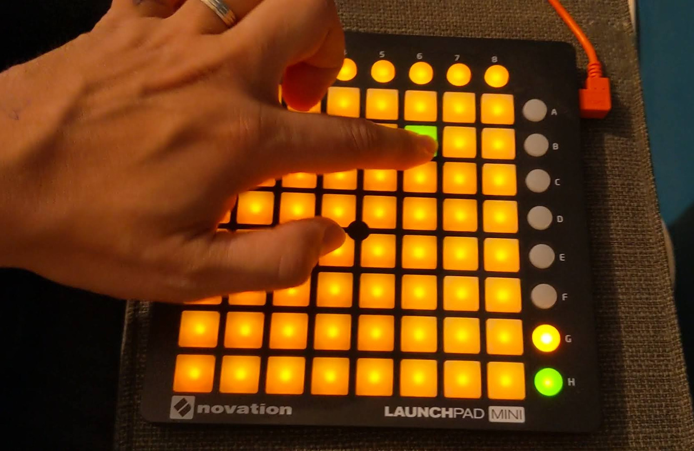
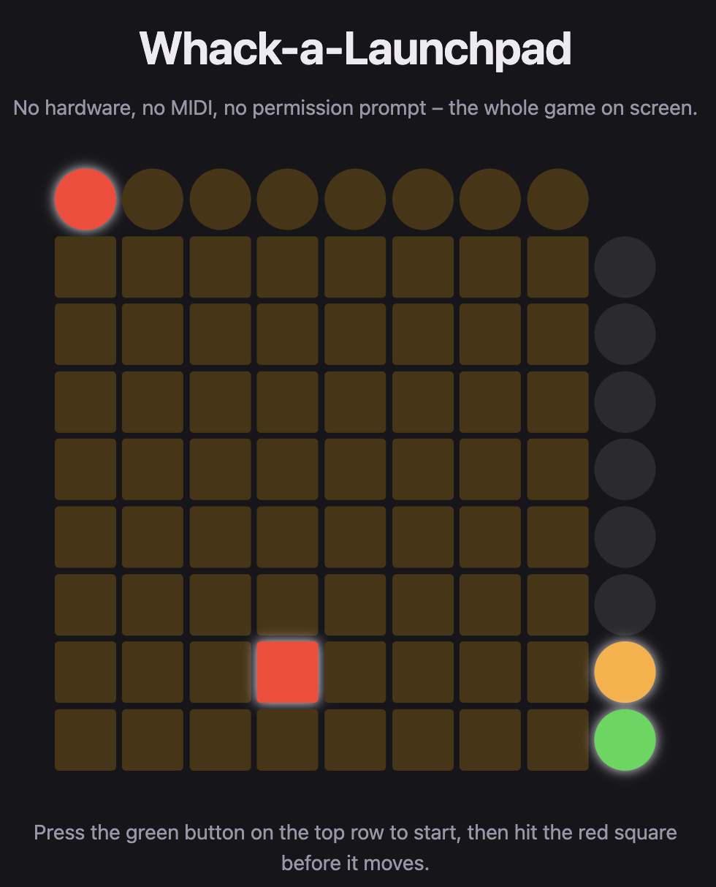

# Whack-a-Launchpad

Whack-a-mole inspired game using Novation Launchpad Mini



It uses the [Launchpad WebMIDI](https://github.com/LostInBrittany/launchpad-webmidi) library to interact with a Novation Launchpad from your browser with the [web MIDI API](https://webaudio.github.io/web-midi-api/).

https://user-images.githubusercontent.com/726476/115941756-1b554980-a4a7-11eb-8d03-d8cdbce6b4e9.mp4

## What you need

- **A Novation Launchpad Mini**, plugged in before you load the page. The library
  matches any MIDI port whose name contains `Launchpad`, so other models will
  connect, but the layout and colours here assume a Mini.
- **A browser with the Web MIDI API** – Chrome, Edge or Opera. Firefox and Safari
  do not implement it, and the page will tell you so rather than sit there silent.
- **Node and npm**, to install the single dependency.

## Running it

```bash
git clone git@github.com:LostInBrittany/whack-a-launchpad.git
cd whack-a-launchpad
npm install
```

The game has to be served over HTTP – opening `index.html` from the filesystem
will not work, because browsers refuse to load ES modules over `file://` and the
Web MIDI API needs a secure context. `localhost` counts as one, so any static
server will do:

```bash
python3 -m http.server 8000
```

Then open <http://localhost:8000> and accept the MIDI permission prompt. The pad
goes dark with one green light, and you are ready to play.

If anything goes wrong the page prints the reason under the title – no Launchpad
found, no Web MIDI support, permission denied.

## No Launchpad? Play the demo

`demo/` runs the same game against
[`granite-launchpad`](https://github.com/LostInBrittany/granite-launchpad), a
web component that mimics the Launchpad Mini, so you can play with nothing
plugged in.



Serve the repository as above and open one of:

| Page | What it plays on |
|---|---|
| <http://localhost:8000/demo/> | `<granite-launchpad-board>` – screen only, no MIDI, no permission prompt |
| <http://localhost:8000/demo/twin.html> | `<granite-launchpad>` – the digital twin, mirroring a real Mini when one is plugged in |

The twin page works either way. With a Launchpad connected, a press on either
side reaches the game and both light up together; without one, it says so and
carries on playing on screen.

Neither page is a second copy of the game. Both import the same `game.js` the
hardware page does and hand it `demo/board-pad.js`, a small adapter that
presents the component through the part of the `launchpad-webmidi` interface
the game uses – `connect()`, `on('key')`, `reset()`, `col()` and the colours.
The game never learns which one it got.

## How to play

1. **Start.** The board is dark except for the leftmost round button on the top
   row, lit green. Press it.
2. **Whack.** The whole pad glows amber and one square lights up red. Hit it
   before it moves.
3. **Keep up.** Every hit turns the square green and scores a point, and the next
   target arrives a little sooner than the last.
4. **Don't miss.** Hitting the wrong square, or letting a target expire, ends the
   run and resets the board.

Your score shows on the round buttons down the right-hand side, filling from the
bottom up, one lamp per five points: amber while you are working through a lamp,
green once you have cleared it.

## Under the hood

The page is plain ES modules with no build step. `index.html` carries an
[import map](https://developer.mozilla.org/en-US/docs/Web/HTML/Element/script/type/importmap)
so the game can import the library by name:

```js
import Launchpad from 'launchpad-webmidi';
```

The map points at `node_modules/launchpad-webmidi/dist/launchpad-webmidi.es.js`,
which is why `npm install` is needed even though nothing is bundled.

The rules live in `game.js`, which takes the pad it plays on:

```js
createGame( pad );
```

`whack-a-launchpad.js` connects a real Launchpad and passes it in; the demo
pages pass an adapter around a web component. That is the whole difference
between them.

## Tests

```bash
npm test
```

[`@web/test-runner`](https://modern-web.dev/docs/test-runner/overview) runs the
suite in headless Chromium against the real component – the adapter, the game
rules played through it, and the twin catching up with a Launchpad that
connects after the board has already been painted. The hardware itself is the
one thing stood in for, since no test runner has a Mini plugged in.
